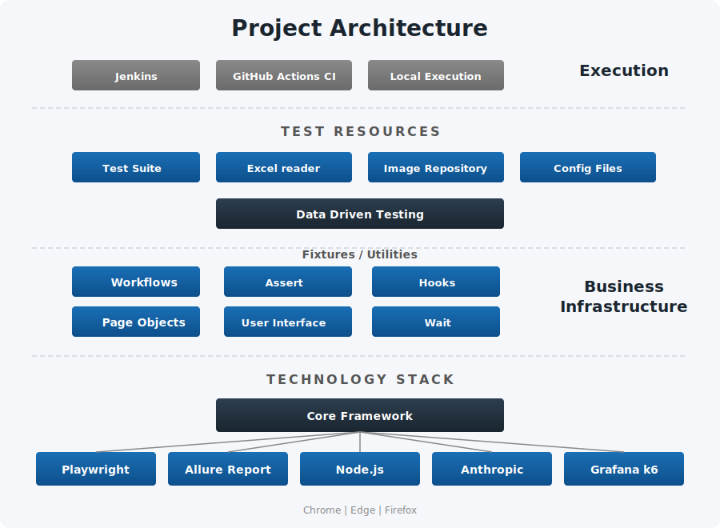

# PrintUp - E2E test automation

End-to-end test automation suite for the PrintUp web application, built with **Playwright**, **Allure** reporting, and run via **Jenkins** or **GitHub Actions**.

---

## Project structure

```
Printup project/
├── base/                        
│   ├── BasePage.js              # Browser lifecycle & navigation
│   ├── SelfHealing.js           # Proxies page.locator(); on failure triggers AriaHealer and patches the source file via AST rewrite
│   └── AriaHealer.js            # Core AI engine: collects POM/flow context, reads Playwright ARIA snapshot, and calls Claude to find a replacement CSS selector
├── configuration/
│   └── playwright.config.js     # Playwright & browser config
├── fixtures/                    # Reusable test utilities
│   ├── Assert.js                # Assertion helpers with Allure steps
│   ├── Hooks.js                 # Setup, teardown & screenshot on failure
│   ├── User interface.js        # UI interactions (click, type, select, check and upload file)
│   └── Wait.js                  # Wait conditions & synchronization
├── pageObjects/                 # Page Object Model (POM)
│   ├── Login.js                 # Locators for the login form (email, password, and action buttons)
│   ├── ClientInfo.js            # Locators for the client info form (name, contacts, checkboxes, notes)
│   ├── ContactInfo.js           # Locators for the contact info form (name, phone, email, role, notes)
│   ├── ProjectInfo.js           # Locators for the project info form (name, date, urgency, status, folder)
│   ├── MaterialsInfo.js         # Locators for the materials form (dropdowns, thickness, category, save)
│   ├── UploadFiles.js           # Locators for file upload elements (design, project files, work order, archive)
│   ├── ItemCenter.js            # Toolbar button locator (by title attribute) for the item-center panel
│   ├── LayersInfo.js            # Locators for the layers panel: upload button, name input, layer description, and icon dropdowns
│   ├── ListInfo.js              # Locators for the list/grid view: filter options, column headers, displayed items, export and icons
│   └── ResetPassword.js         # Locators for the reset-password form (new password, confirm password, submit)
├── workflows/                   # The main workflows of the E2E testing
│   ├── index.js                 # Gathers all workflow classes into one object and exports
│   ├── LoginFlow.js             # Fills credentials from env vars and verifies login
│   ├── ClientInfoFlow.js        # Fills the client info form with test data
│   ├── ContactInfoFlow.js       # Fills the contact info form with test data
│   ├── ProjectInfoFlow.js       # Fills the project info form with test data
│   ├── MaterialsInfoFlow.js     # Selects material options, sets thickness and proceeds to next section
│   ├── LayersInfoFlow.js        # Uploads layer files and fills layer details
│   ├── ListInfoFlow.js          # Fills the list info form with test data
│   └── ForgotPasswordFlow.js    # Requests a password reset, reads the reset link from Gmail via IMAP, and sets a new password
├── Suite/                       # Test specs
│   └── SanityTest.spec.js       # Main sanity E2E suite
├── TDD/                         # Test data
│   ├── ExcelReader.js           # Excel parser utility
│   └── TestData.xlsx            # Data-driven test data
├── Matirals/                    # Upload test files (SVGs)
├── k6/
│   └── loadTest.js              # k6 load test: ramp-up/hold/ramp-down stages with p95 response-time and error-rate thresholds
├── jenkins/
│   └── casc.yaml                # Jenkins Configuration-as-Code: defines the `printup` pipeline job and its credentials
├── Jenkinsfile                  # Jenkins pipeline: installs deps, runs Playwright tests per browser param, publishes Allure results
├── .github/
│   ├── actions/k6-load-test/
│   │   └── action.yml           # Reusable composite action that installs k6 and runs the load test script
│   └── workflows/
│       ├── E2E test.yml         # GitHub Actions CI
│       └── k6 load test.yml     # Manual-dispatch workflow to run k6 with configurable virtual users and duration
├── .env                         # Environment variables
└── package.json                 # NPM config with scripts for tests, Allure reports, and k6 load testing
```

---

## Architecture



| Layer | Purpose |
|-------|---------|
| **Suite** | Test specs that define test cases in serial order |
| **Workflows** | Multi-step user flows (login, add client, add project, etc.) |
| **Page Objects** | Encapsulate UI element locators per page |
| **Fixtures** | Reusable utilities: assertions, UI actions, waits, hooks |
| **TDD** | Excel-driven test data parsed by ExcelReader |
| **Base** | `BasePage` handles browser launch, navigation, and config access. `SelfHealing` wraps every `page.locator()` call — if a selector fails, it sends the broken selector and Playwright ARIA snapshot to Claude and retries with the AI-suggested replacement, then writes the fix back into the page object file |

---

## Test flow

Tests run **serially** since each step depends on the previous:

```
#1 Login  -->  #2 Add Client  -->  #3 Add Contact  -->  #4 Add Project  -->  #5 Add Material  --> #6 LayersInfoFlow  --> #7 ListInfoFlow
```

Each workflow reads its data from `TestData.xlsx` and supports multiple iterations.

---

## Setup

### Prerequisites
- Node.js 20+
- Playwright browsers installed

### Install
```bash
npm install
npx playwright install --with-deps
```

---

## Running tests

These scripts run the automation and open Allure report:
```json
"scripts": {
    "test": "npx rimraf allure-results && npx playwright test --config=configuration/playwright.config.js --project chrome",
    "test:report": "npm test && npm run allure:report",
    "allure:report": "npx allure generate allure-results --clean -o allure-report && npx allure open allure-report",
    "k6": "node -e \"require('dotenv').config();require('child_process').execFileSync('k6',['run','--env','BASE_URL='+process.env.URL,'k6/loadTest.js'],{stdio:'inherit'})\""
}
```

### Run chrome browser with Allure report
```bash
npm run test:report
```

---

## Multi-Browser support

Configured in `playwright.config.js` with three projects:

| Command | Browser | Engine |
|---------|---------|--------|
| `/playwright.config.js --project chrome` | Google Chrome | Chromium |
| `/playwright.config.js --project edge` | Microsoft Edge | Chromium |
| `/playwright.config.js --project firefox` | Mozilla Firefox | Gecko |

---

## Reporting

### Allure report
- Every UI action is logged as an **Allure step**
- Tests are tagged with **Allure features** (Login, Client info, etc.)
- **Screenshots** are automatically captured and attached on failure
- Sensitive data (passwords, emails) is **masked** in the report

### Screenshot on failure
Saved to `screenshots/{YYYY-MM-DD}/{testTitle}.png` and attached to the Allure report.

---

## Data-Driven testing

Test data lives in `TDD/TestData.xlsx`, organized by sections:

| Section | Description |
|---------|-------------|
| `ClientInfoFlow` | Client names, phone numbers, emails, roles |
| `ContactInfoFlow` | Additional contact details |
| `ProjectInfoFlow` | Project names, dates, urgency, file paths |
| `MaterialsInfoFlow` | Material types, thickness, colors, textures |

The `ExcelReader` parses each section by class name and returns an array of data objects.

---

## CI/CD - GitHub Actions

The workflow (`.github/workflows/E2E test.yml`) runs via **manual dispatch** with browser selection:

**Trigger:** GitHub Actions > Run workflow > Select browser (chrome/edge/firefox)

**Pipeline:**
1. Checkout code
2. Setup Node.js 20
3. Install dependencies
4. Install Playwright browsers
5. Run E2E tests with selected browser
6. Generate & upload Allure report as artifact (30-day retention)
7. Run k6 load test after E2E tests complete

---

## CI/CD - Jenkins

The `Jenkinsfile` defines the `printup` pipeline job (provisioned via `jenkins/casc.yaml`), parameterized by browser (chrome/firefox/edge):

**Pipeline:** Install deps → install Chromium → run Playwright tests → publish Allure results & archive the report

Credentials (`PRINTUP_URL`, `PRINTUP_EMAIL`, `PRINTUP_PASSWORD`, `PRINTUP_APPLITOOLS_KEY`) are injected from the Jenkins credential store.

---

## Load testing - Grafana k6

The workflow (`.github/workflows/k6 load test.yml`) runs via **manual dispatch** with configurable load parameters:

**Trigger:** GitHub Actions > Run workflow > Set virtual users & duration

**Stages:** Ramp up → Hold → Ramp down

**Thresholds:**
- 95% of requests must complete under 3s
- Error rate must stay below 5%

Results are uploaded as an artifact (30-day retention).

---

## Tech stack

| Tool | Purpose |
|------|---------|
| [Playwright](https://playwright.dev/) | Browser automation & test runner |
| [Allure](https://allurereport.org/) | Test reporting |
| [xlsx](https://www.npmjs.com/package/xlsx) | Excel data parsing |
| [dotenv](https://www.npmjs.com/package/dotenv) | Environment variable management |
| [GitHub Actions](https://github.com/features/actions) | CI/CD pipeline |
| [Jenkins](https://www.jenkins.io/) | Alternate CI/CD pipeline (Jenkinsfile + Configuration-as-Code) |
| [Grafana k6](https://k6.io/) | Load & performance testing |
| [Applitools Eyes](https://applitools.com/) | Visual (screenshot) regression testing |
| [imapflow](https://www.npmjs.com/package/imapflow) | Reads reset-password emails via IMAP for the forgot-password flow |
| [node-autoit-koffi](https://www.npmjs.com/package/node-autoit-koffi) | Drives native Windows file-upload dialogs |
| [Anthropic Claude](https://www.anthropic.com/) | AI self-healing — finds replacement selectors via ARIA snapshot |
